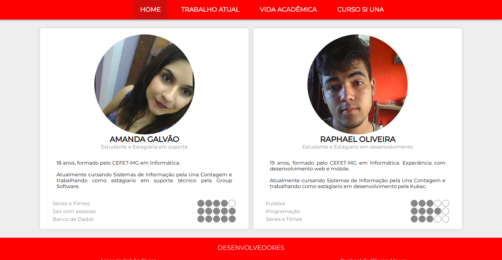
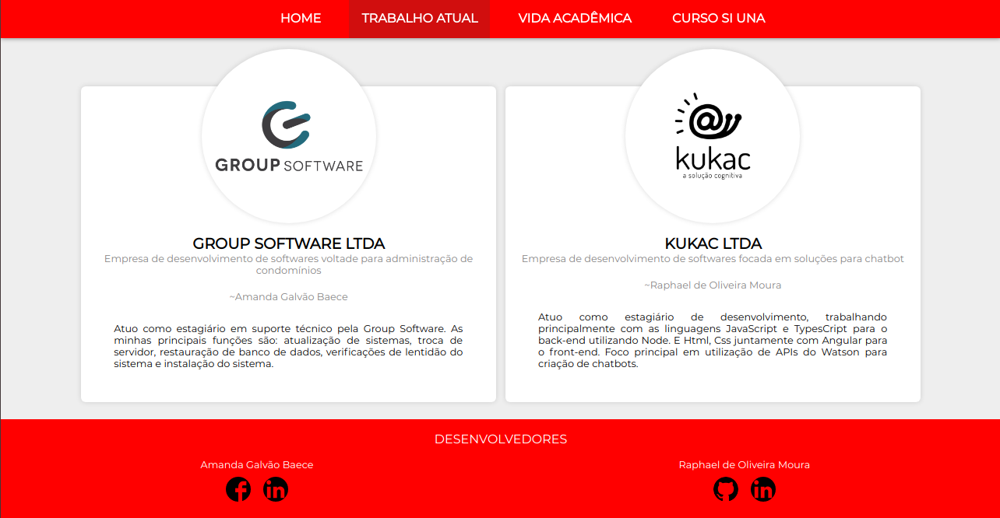
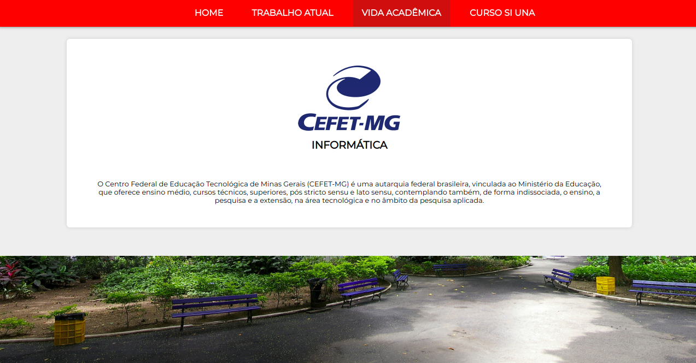
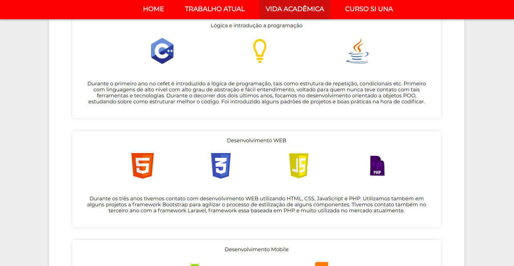
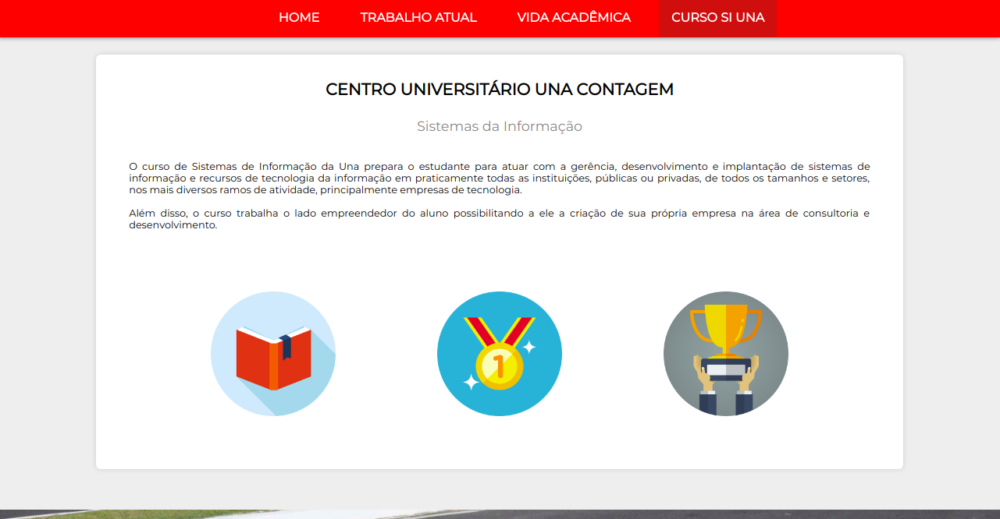
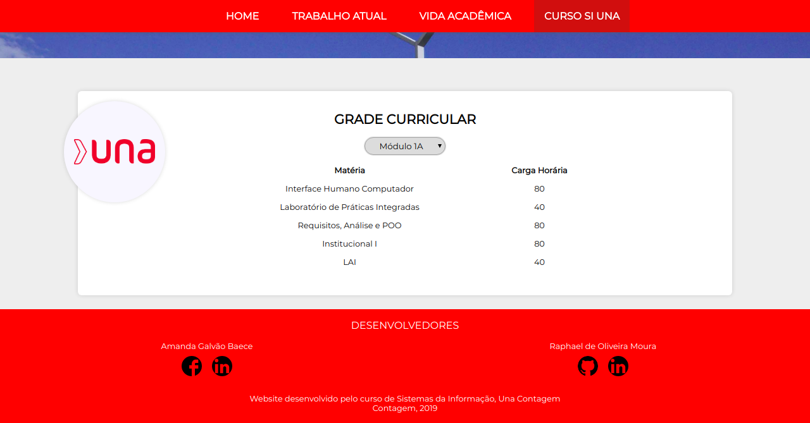

## Table of contents 📋
1. [Description](#description) ✔️
   1. [Content](#content) ✔️
   1. [Screens](#screens) ✔️
1. [Installation](#installation) ✔️
1. [Technologies](#technologies) ✔️
1. [Architeture](#architeture)
1. [Contributing](#contributing) ✔️
   1. [Contributors](#contributors) ✔️
   1. [License agreements](#license-agreements) ✔️

## Description

### Content
💎 This is a project made on work for the Human Computer Interface discipline at UNA university.
It is a website that has informations such as developers profiles, academic formation and current job informations.

### Screens







## Installation
💻 To run and test the website localy, just clone the project or downloaded with a zip extension:
```
git clone https://github.com/RaphaelOliveiraMoura/website-ihc.git
```
After, you need enter inside the src folder and open the index.html file.

## Technologies
🎈 To build this project we used the current technologies:
* HTML 5
* CSS
* JavaScript

## Architeture

## Contributing
#### Contributors
🧑 Developers
* Amanda Galvão Baece
* Raphael de Oliveira Moura

### License agreements
This is a open source project, so everybody can download it and use it from the any way in any project.